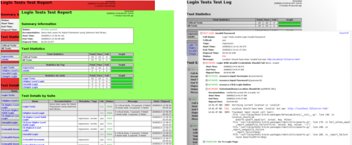

.. _Introduction:

Robot Framework の紹介
========================

Robot Framework は、Python ベースの拡張可能なキーワード駆動型 (keyword-driven) テスト自動化フレームワークです。
エンドツーエンドの受け入れテストや受け入れテスト駆動開発 (ATDD) に使えます。
Robot Framework は、分散・機種混合環境で、様々な技術・インタフェースを使わねばならないアプリケーションのテストに利用できます。

.. contents::
   :depth: 2
   :local:

.. _Why Robot Framework?:

Robot Framework を使う理由
------------------------------

- 簡単なテーブル形式で、一貫した書き方で `テストを作成 <creating test cases>`_ できます。

- 定義済みのキーワードを使って、再利用性の高い `高水準のキーワード <higher-level keywords>`_ を作れます。

- 読みやすい HTML 形式の `結果レポート <reports>`_ と `ログ <logs>`_ を出力できます。

- 特定のプラットフォームやアプリケーションに依存しません。

- Python や Java でテストライブラリを自作するための簡単な `ライブラリAPI <library API_>`_ を備えています。

- 既存の様々なビルドインフラ (CI: 継続開発システム) と連携できるよう、 `コマンドラインインタフェース <command line interface_>`__ を持ち、 XML ベースの `出力ファイル <output files_>`_ を生成します。

- Selenium を使った Web テスト、 Java の GUI テスト、プロセスの実行、 Telnet, SSH 操作などをサポートしています。

- `データ駆動のテストケース <data-driven test cases_>`__ 開発をサポートしています。

- 様々な環境でテストを使う際に便利な `変数 <variables_>`_ を組み込みでサポートしています。

- テストに `タグ付け <tagging_>`__ して、 `テストを選択的に実行 <select test cases_>`__ できます。

- ソースコード管理との連携が容易: `テストスイート <test suites_>`_ はファイルとディレクトリだけで構成され、成果物のコードと一緒にバージョン管理できます。

- `テストケース <test-case_>`__ と `テストスイート <test-suite_>`__ の両方のレベルでセットアップ・ティアダウンを実行できます。

- モジュラーな構造をとっているため、全く違うインタフェースを複数持つようなアプリケーション向けにもテストを書けます。

__ `Executing test cases`_
__ `Data-driven style`_
__ `Tagging test cases`_
__ `Selecting test cases`_
__ `Test setup and teardown`_
__ `Suite setup and teardown`_

.. High-level architecture:

高水準のアーキテクチャ
-----------------------

Robot Framework は、特定のアプリケーションや技術に依存しない、汎用のフレームワークです。
以下の図のように、モジュラー性の高いアーキテクチャを備えています。

.. figure:: architecture.png

   Robot Framework のアーキテクチャ

`テストデータ <test data_>`_ は、シンプルで編集しやすいテーブル形式のフォーマットです。
Robot Framework を起動すると、フレームワークがテストデータを処理し、テストデータ中の  `テストケースを実行 <executes test cases_>`__ して、実行ログとレポートを生成します。フレームワークのコア部分は、テスト下にあるターゲットシステムの詳細は関知せず、 `テストライブラリ <test libraries_>`__ を通じてやり取りします。ライブラリはアプリケーションのインタフェースを直接使う場合もあれば、他の低水準のテストツールをテストドライバとして使う場合もあります。

__ `Executing test cases`_
__ `Creating test libraries`_

.. Screenshots:

スクリーンショット
---------------------

以下のスクリーンショットは、 `テストデータ <test data>`_ と、テストを実行して得た `レポート <reports>`_ や `ログ <logs>`_ の例です。

.. figure:: testdata_screenshots.png

   テストケースファイル

   テストレポートとログ

.. _Getting more information:

詳しい情報を探すには
------------------------

.. _Project pages:

Robot Framework プロジェクトのページ
~~~~~~~~~~~~~~~~~~~~~~~~~~~~~~~~~~~~~~~~

Robot Framework やそれをとりまくエコシステムの情報がまとまっている一番の場所は、なんといっても  http://robotframework.org です。フレームワーク自体のソースコードは GitHub__ 上で管理されています。

__ https://github.com/robotframework/robotframework

.. _Mailing lists:

メーリングリスト
~~~~~~~~~~~~~~~~~~

Robot Framework 関連のメーリングリストは複数あり、詳しい情報を調べたり質問したりできます。
メーリングリストのアーカイブは公開で、誰でも  (検索エンジンも) 閲覧できます。
もちろん、参加も自由です。ただし、投稿できるのはメーリングリストのメンバーだけです。
また、スパム対策のため、新規ユーザの投稿は、最初に投稿した記事が無事掲載されるまで、しばらくの間モデレーションの対象になります。メーリングリストへの投稿は歓迎ですが、
`上手な質問の仕方 <How To Ask Questions The Smart Way>`__ を心がけましょう。

robotframework-users__
   Robot Framework に関する一般的な話題を扱うメーリングリストです。
   質問や問題点の議論はここに投稿しましょう。
   他のユーザに共有したい情報がある場合も、ここに投稿してください。

robotframework-announce__
    アナウンスのみのメーリングリストで、モデレータしか投稿できません。
    ここに投稿されるアナウンスは robotframework-users にも投稿されるので、どちらかにだけ入っておけば大丈夫です。

robotframework-devel__
   Robot Framework の開発に関する議論のメーリングリストです。

__ http://www.catb.org/~esr/faqs/smart-questions.html
__ http://groups.google.com/group/robotframework-users
__ http://groups.google.com/group/robotframework-announce
__ http://groups.google.com/group/robotframework-devel
